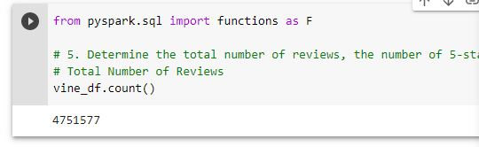
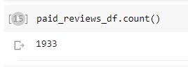
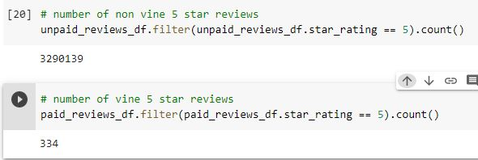
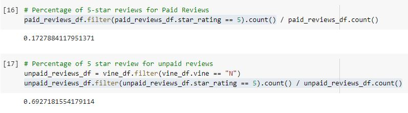

# Amazon Vine Analysis

## Overview 
The purpose of this analysis was to analyze Amazon reviews written by members of the paid Amazon Vine program. I chose a dataset about music, and used PySpark to perform the ETL process, connected to an AWS RDS instance, and loaded the transformed data into pgAdmin. Finally, I used PySpark to determine if there is any bias toward favorable reviews from Vine members in the dataset I chose.

---

## Results: 

**How many Vine reviews and non-Vine reviews were there?**
In my dataset there were a total of 4,751,577 reviews. There are 1,933 Vine Reviews and 4,749,607 non-Vine reviews. 

**How many Vine reviews were 5 stars? How many non-Vine reviews were 5 stars?**
There were 334 5 star vine reviews and 3,290,139 5-star non-Vine reviews.

**What percentage of Vine reviews were 5 stars? What percentage of non-Vine reviews were 5 stars?**
17.28% of Vine reviews were 5 stars, and 69.27% of non-Vine reviews were 5 stars.

---
## Summary: 

There does not appear to be an positivity bias for reviews in the Vine program for the dataset I selected. In fact, there was a much higher percentage of five star reviews for non Vine program reviews. I would suggest also doing an analysis comparing the percentage of 4 star reviews to see if maybe the paid reviewers felt more pressure to give critiques, and therefor gave a lot of 4 star reivews. 

